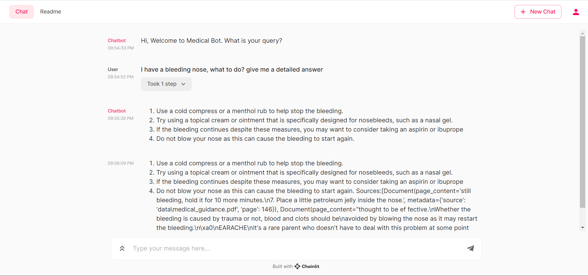

# EcoMed Expert 👨‍⚕️🏭

Welcome to [EcoMed](https://www.youtube.com/watch?v=AnA3aqsuNN0) 🤖 Expert, your trusted companion for a healthier you and a greener planet! Our chatbot is here to empower you with knowledge and solutions that not only enhance your well-being but also contribute to a sustainable world. Whether you have questions about your health or seek insights into environmental science, we've got you covered. Join us on a journey to treat yourself and the environment with care, making a positive impact every day.

## Retrieval Augmented Generation

I am using a methodology called as Retrieval Augmented generation:

In RAG, the external data can come from multiple data sources, such as a document repository, databases, or APIs. 
- The first step is to convert the documents and the user query in the format so they can be compared and relevancy search can be performed. To make the formats comparable for doing relevancy search, a document collection (knowledge library) and the user-submitted query are converted to numerical representation using embedding language models. 
- The embeddings are essentially numerical representations of concept in text. Next, based on the embedding of user query, its relevant text is identified in the document collection by a similarity search in the embedding space. 
- Then the prompt provided by the user is appended with relevant text that was searched and it’s added to the context. 
- The prompt is now sent to the LLM and because the context has relevant external data along with the original prompt, the model output is relevant and accurate.

## Data Ingestion 

1. Gathered Data about Environmental Science
2. Using the Book named "Survival Medicine Guidance" for medical data
3. Using ***FAISS-CPU*** as **vector database** to store data in chunks, which will then help is in retrieving data chunks using semantic search

Note: All the data is in the pdf format

## Langchain 🦜️🔗

LangChain is a framework for developing applications powered by language models. It enables applications that:

1. Are context-aware: connect a language model to sources of context (prompt instructions, few shot examples, content to ground its response in, etc.)
2. Reason: rely on a language model to reason (about how to answer based on provided context, what actions to take, etc.)
3. ***We are using Langchain to connect to LLM - LLAMA2***

## Llama 2

Llama 2 was pretrained on publicly available online data sources.
The fine-tuned model, Llama Chat, leverages publicly available instruction datasets and over 1 million human annotations.

- We are using the Llama2 with 7b (7 billion) parameters as our large language model, which takes the input query along with the context to get our desired result

## Chainlit 👋 (Gives User Interface)

Chainlit is an open-source Python package that makes it incredibly fast to build and share LLM apps. Integrate the Chainlit API in your existing code to spawn a ChatGPT-like interface in minutes!

- This integrates everything above and gives us a user interface, lets take a look at it below

## [BOT 🤖 DEMO LINK](https://www.youtube.com/watch?v=AnA3aqsuNN0)

## Future Steps

1. Deploy the application
2. Gather more data about and keep on updating the existing information
3. Try different LLM's that give better results
4. Open for collaboration and new IDEAS
